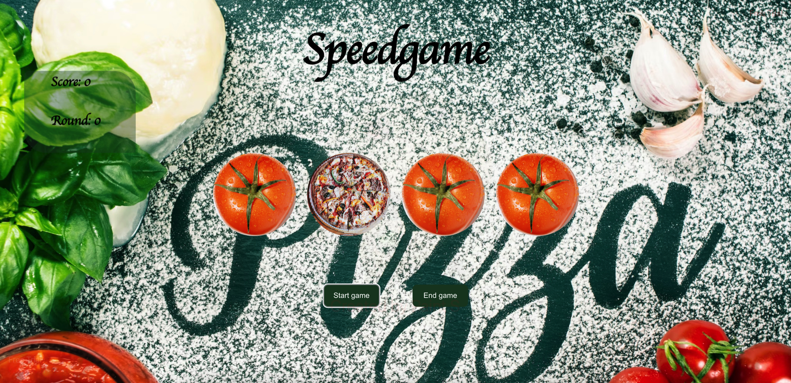

# SpeedGame:

## Short discription

This game is made in REACT with a personal touch and animations. The main idea of the game is to click on the emerging pizzas as fast as possible. You have 3 chances to fail in every time you play. You get different messages every time depending on you points.

## Technologies used

### Built with:

- HTML
- CSS
- REACT
- JS

## Setup and usage

Live page here

## Screenshot

### Authors and acknowledgment

Eyvaz Alishov

- GitHub @CodeLaMat
- [LinkedIn](https://www.linkedin.com/in/eyvaz-alishov-54361054/)
